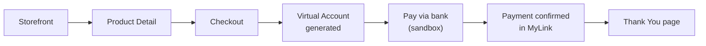
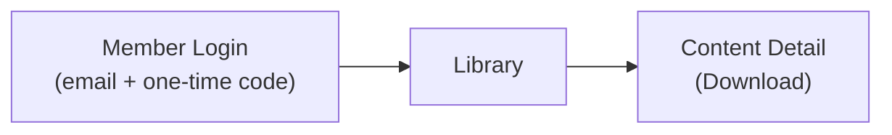
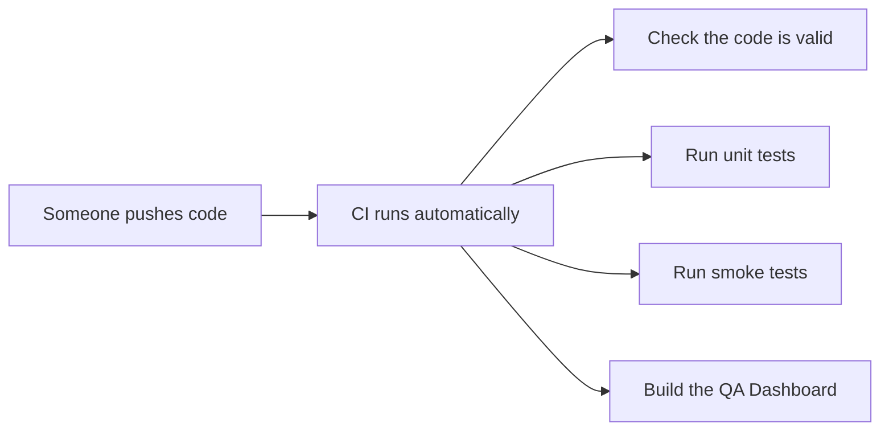

# Qato — QA Automation Platform

Qato automatically checks that Lynk.id's three applications still work, so a human doesn't have
to click through the same login-and-purchase flow by hand every time something changes.

This guide assumes no prior experience with test automation. If you already know Playwright,
Page Objects, and CI pipelines, you probably want the technical reference instead:
[`docs/ENGINEERING.md`](docs/ENGINEERING.md).

---

## Quick navigation by role

| If you are a... | Start with |
|---|---|
| QA Manual tester / UAT team member | [What Qato does](#what-qato-does), [Reading a test report](#reading-a-test-report) |
| Junior QA / QA Automation Engineer | [Getting started](#getting-started), [What's actually tested today](#whats-actually-tested-today), [Test suite strategy](#test-suite-strategy-smoke-vs-regression), [Running tests by application or category](#running-tests-by-application-or-category) |
| Developer | [Getting started](#getting-started), [Running tests by application or category](#running-tests-by-application-or-category), then [`docs/ENGINEERING.md`](docs/ENGINEERING.md) |
| Business Analyst / Product Manager | [What Qato does](#what-qato-does), [Test suite strategy](#test-suite-strategy-smoke-vs-regression) |
| DevOps Engineer | [Test suite strategy](#test-suite-strategy-smoke-vs-regression), [How tests run automatically](#how-tests-run-automatically-cicd), then [`ci/README.md`](ci/README.md) |

---

## What Qato does

Lynk.id has three applications:


Every time one of these changes, someone needs to check it still works: can a creator still log
in? Can a customer still buy something? Can a buyer still download what they paid for? Doing this
by hand, every time, for every change, doesn't scale. Qato does it automatically instead, using a
tool called **Playwright** that drives a real web browser the same way a person would — clicking
buttons, typing into fields, checking that the right thing appears on screen.

This is called **test automation**, and the individual checks are called **automated tests** (or
just "tests"). A collection of related tests is a **test suite**.

---

## What's actually tested today

Qato doesn't test everything yet — it tests three real, verified flows. Being upfront about scope
matters more than sounding comprehensive: if a test doesn't exist yet, that's stated plainly below
rather than implied to be covered.

### 1. Creator login and order visibility

A creator logs into the CMS and confirms their Product Orders list loads. This is the simplest
flow — the "is the CMS even up" check.

### 2. Guest checkout and payment (the purchase flow)



A customer browses the storefront, picks a product, checks out as a guest (email only, no
account), and pays using a **Virtual Account** — a common Indonesian payment method where the
bank generates a unique account number to transfer money into. In development and staging, this
payment is completed automatically through Duitku's **sandbox** (a safe, fake-money testing
environment payment providers offer so nobody has to use real money to test a real payment flow).
The test confirms the payment shows as complete back on the site, and that a "Thank You" page
appears.

This only runs in development and staging — not production, where a live payment can't safely be
simulated the same way.

### 3. Member login, library, and download



A member logs into the Member Area and downloads something they've already purchased.

**Important limitation:** logging into the Member Area requires a one-time password (a 6-digit
code, usually called an **OTP** — "one-time password" — sent to the member's real email inbox
every time). Nobody has built a way to fetch that code automatically yet, so this specific test
**cannot run unattended**. A human has to check the inbox, grab the code, and supply it manually
each time this test runs. It's not broken — it's a real, current limitation, explained further in
[Known limitations](#known-limitations).

---

## Key terms you'll see

Explained here once, in plain language, so the rest of this guide doesn't have to keep stopping to
define things.

| Term | What it means |
|---|---|
| **Repository** ("repo") | The folder containing all of Qato's code, tracked by a tool called Git so changes are recorded over time. |
| **Clone** | Downloading a copy of the repository onto your own computer. |
| **Terminal** / **command line** | A text-based window where you type commands instead of clicking. Every instruction below that starts with `$` is something you type into a terminal. |
| **Dependencies** | Other people's code that Qato relies on (e.g. Playwright itself). Installing dependencies downloads all of it in one step. |
| **pnpm** | The tool used to install dependencies and run project commands. Similar to `npm`, if you've heard of that. |
| **Monorepo** | One repository containing several related projects (the test automation, the dashboard, shared config) instead of scattering them across separate repositories. |
| **Environment** | Which version of the app you're testing against — your local machine, the development server, staging (a pre-production copy), or production (the real, live site). |
| **Environment file** (`.env.dev`, etc.) | A file listing which web addresses and login details to use for a given environment. Covered in [Setting up your environment](#3-set-up-your-environment). |
| **Test suite** | A group of related automated tests. |
| **Smoke test** | A quick, shallow test suite meant to answer "is anything obviously broken?" fast — not exhaustive, but fast enough to run on every code change. Full explanation: [Test suite strategy](#test-suite-strategy-smoke-vs-regression). |
| **Regression test** | A broader, slower test suite that checks whether a recent change broke something that used to work. Full explanation: [Test suite strategy](#test-suite-strategy-smoke-vs-regression). |
| **CI / CI-CD** | "Continuous Integration / Continuous Delivery" — running tests automatically (e.g. every time someone pushes code), instead of a person remembering to run them. |
| **JUnit report** | A standard file format test tools use to record what passed, what failed, and why. Machine-readable; you won't usually read it directly. |
| **Dashboard** | Qato's own web page that reads that report and shows it in a human-friendly way. See [The QA Dashboard](#the-qa-dashboard). |

---

## Getting started

### Prerequisites

You'll need two things installed on your computer first:

1. **Node.js**, version 22. This project pins the exact version in a file called `.nvmrc`.
2. **A terminal.** On macOS/Linux, the built-in Terminal app works. On Windows, use PowerShell or
   WSL.

Check you have Node installed by running:

```bash
node --version
```

You should see something like `v22.x.x`. If you don't have Node at all, install it from
[nodejs.org](https://nodejs.org) before continuing.

### 1. Get the code

```bash
git clone <repository-url>
cd qato
```

("Clone" just means download a copy — see [Key terms](#key-terms-youll-see).)

### 2. Install dependencies

```bash
corepack enable
pnpm install
```

The first command turns on `pnpm` (it ships with Node but is off by default). The second
downloads everything Qato needs to run — Playwright, the testing libraries, everything. This can
take a minute or two the first time.

**One more one-time step** — install the actual browsers Playwright will control:

```bash
npx playwright install
```

Without this step, tests will fail immediately with an error about a missing browser.

### 3. Set up your environment

Qato needs to know which environment to test against and what credentials to use. This lives in
files named `.env.local`, `.env.dev`, `.env.staging`, and `.env.prod` at the top of the project.

Some values are already filled in (the web addresses for each environment, a test product, a test
member account). Others are placeholders that say `CHANGE_ME` — specifically the CMS login
username and password. **You need real values for those before creator-login tests will work.**
Ask a team member with CMS access for test credentials, then edit `.env.local` (or whichever
environment file you're using) and replace `CHANGE_ME`.

Don't have real CMS credentials yet? That's fine — the guest checkout test doesn't need them, so
you can still run part of the suite while you sort that out.

**Everything Qato tests with is configurable this way — nothing is hardcoded in the automation
code itself.** If your team's test product changes, a payment method changes, or you're setting
this up against a different creator account, you only ever need to edit these files.

Every variable falls into one of four categories, and `.env.example` labels each one so you never
have to guess:

| Status | Meaning |
|---|---|
| **Required** | Every environment must have a real value here, or tests will fail with a clear validation error at startup. |
| **Optional** | Safe to leave blank. Any test that needs it will skip itself with a clear message rather than fail or guess. |
| **Verified** | Confirmed correct against the real application (usually via Playwright's recording tool). |
| **Unverified — left blank** | Nobody has confirmed the real value yet. Left blank on purpose rather than guessed, so a wrong guess never quietly becomes "how the test works." |

| To change... | Edit this variable | Status |
|---|---|---|
| CMS login | `CMS_USERNAME`, `CMS_PASSWORD` | Required — currently a placeholder (`CHANGE_ME`) until your team fills in real credentials |
| Member Area test account | `MEMBER_EMAIL` | Required, verified |
| Creator account | `CREATOR_SLUG` | Required, verified |
| Product being purchased | `TEST_PRODUCT_NAME`, `TEST_PRODUCT_PRICE`, `TEST_PRODUCT_TYPE`, `TEST_PRODUCT_CURRENCY` | Required, verified |
| Exact text of the product link on the storefront | `TEST_PRODUCT_LINK_LABEL` | Optional — verified for local/development/staging; unverified and left blank in production (see below) |
| Payment method used for the Virtual Account test | `TEST_PAYMENT_METHOD_POSITION`, `TEST_PAYMENT_METHOD_CHANNEL_LABEL`, `TEST_PAYMENT_METHOD_DISPLAY_NAME` | Optional — verified for local/development/staging; intentionally blank in production, for a different reason (see below) |
| Which environment/URLs are being tested | Which `.env.*` file you're editing, or `APP_ENV` | Required, verified |

**Why production leaves two things blank, and why they're not the same kind of "blank":**

- `TEST_PRODUCT_LINK_LABEL` is blank in production because nobody has confirmed what the real text
  looks like there yet — the storefront formats prices differently depending on the amount, and
  production's test product is priced low enough that the formatting rule is genuinely unknown.
  This is a "we haven't checked yet" blank.
- The payment method fields are blank in production for a completely different reason: the
  Virtual Account payment test uses a payment provider's **sandbox** (safe fake-money testing
  environment), and a sandbox has no reason to ever run against the real production site,
  regardless of whether anyone's confirmed a value for it. This is a "doesn't apply here" blank.

Either way, a test that needs a missing value skips itself with a message telling you exactly
which variable to fill in — it never fails confusingly, and it never guesses.

### 4. Run the tests

To run the smoke suite (the fast, everyday check):

```bash
pnpm test:smoke
```

You'll see output scroll by in the terminal — each test's name followed by a pass or fail. A
successful run looks roughly like:

```
✓  [cms] › login.spec.ts:5:5 › creator can log in and view the Product Orders list
✓  [public] › guest-checkout.spec.ts:22:5 › guest can complete checkout...
✓  [member] › request-otp.spec.ts:5:5 › member can request an OTP...

3 passed (12.4s)
```

By default this runs against the `local` environment. To run against a different one:

```bash
APP_ENV=staging pnpm test:smoke
```

There's also a broader **regression suite** (`pnpm test:regression`) that includes everything in
smoke plus a few more thorough checks — some of which need extra manual input (like the OTP code
mentioned above) and will skip themselves cleanly if you don't provide it, rather than fail.

You can also run tests for just one application (`pnpm test:cms`, `pnpm test:mylink`,
`pnpm test:member`) or just payment-related tests (`pnpm test:payment`) — see
[Running tests by application or category](#running-tests-by-application-or-category).

### 5. Look at the results

Once tests finish, two things are generated automatically:

- **An HTML report** at `automation/playwright/reports/html/index.html` — open this file in any
  web browser (double-click it, or drag it into a browser window). It shows every test, and for
  any failure, a screenshot, a video recording, and a step-by-step trace of exactly what the
  browser did.
- **A JUnit XML file** at `automation/playwright/reports/junit/results.xml` — this is the
  machine-readable version, mainly used by CI and the Dashboard. You generally don't need to open
  this yourself.

---

## Reading a test report

Every test ends in one of three states:

| Status | What it means |
|---|---|
| **Passed** ✓ | The check succeeded — the app did what was expected. |
| **Failed** ✗ | Something didn't match what was expected. This needs investigating — see [When a test fails](#when-a-test-fails). |
| **Skipped** | The test intentionally didn't run. Not a failure — usually because something it needs (like a fresh OTP code) wasn't provided. |

For a failed test, the HTML report (see above) is the best place to look: it shows exactly what
the browser saw at the moment of failure, alongside a video of everything leading up to it.

---

## The QA Dashboard

Qato includes a small web app that reads the same report and shows it as a simple dashboard: a
pass-rate ring, counts of passed/failed/skipped, and a table of every test with its status and
duration. It's meant to be the fastest way to answer "did the last run go okay?" without opening a
terminal.

To run it:

```bash
cd apps/qa-dashboard
pnpm dev
```

Then open `http://localhost:3000` in your browser. If no test run has happened yet, it'll tell you
so and suggest running `pnpm test:smoke` first — it only ever shows the result of the most recent
run, not history over time (a deliberate, current limitation — see
[Known limitations](#known-limitations)).

---

## When a test fails

A step-by-step checklist, roughly in the order worth checking:

1. **Read the error message in the terminal first.** Playwright's error messages are usually
   specific (e.g. "element not found" or "timed out waiting for..."), and often tell you exactly
   what to check.
2. **Open the HTML report** (`automation/playwright/reports/html/index.html`). Click the failed
   test. Look at the screenshot and the trace — this is almost always faster than guessing from
   text alone.
3. **Check for `CHANGE_ME` errors.** If the error mentions an environment variable and says
   something like "must not be empty" or a validation failure, you likely still have a placeholder
   credential — see [Set up your environment](#3-set-up-your-environment).
4. **Check whether the real application actually changed.** Sometimes a test fails because the
   real app's design changed (a button moved, a label changed) — not because anything is "broken."
   That's useful information too; flag it to whoever owns that part of the app.
5. **For the OTP-dependent download test specifically** — it's *expected* to skip unless you supply
   a fresh code yourself. See [Known limitations](#known-limitations).

---

## Test suite strategy: smoke vs. regression

Qato organizes its tests into two groups, called **suites**. Understanding the difference matters
for everyone on this list, not just engineers — it explains why some checks happen in seconds on
every code change, while others happen once a night, and why that's a deliberate choice rather
than something not yet finished.

### What is a smoke test?

The term comes from hardware testing: plug something in, turn it on, and see if it visibly smokes
before you bother testing anything more detailed. If it smokes, there's no point checking the
finer details yet — something fundamental is broken.

In software, a **smoke test** is the same idea: a small, fast set of checks that answer one
question — **"is anything obviously broken?"** Not exhaustive. Not deep. Just fast enough to run
constantly without anyone noticing the wait.

In Qato, `@smoke` currently covers 3 things: can a creator log in, can a guest buy something, and
does starting a member login trigger the expected next step. Nothing exotic — the load-bearing
paths.

### What is a regression test?

A **regression** means something that used to work has stopped working — usually because of a
recent change elsewhere in the system. A **regression suite** is a broader, slower set of checks
built specifically to catch that: not just "is anything obviously broken," but "did this change
quietly break something that used to be fine."

In Qato, `@regression` includes everything `@smoke` covers, plus checks that are slower, need
extra setup, or have real-world side effects that make them unsuitable for running dozens of times
a day (more on that below).

### Side by side

| | `@smoke` | `@regression` |
|---|---|---|
| Question it answers | "Is anything obviously broken?" | "Did this change break something that used to work?" |
| Typical speed | Seconds | Can include slower, heavier flows |
| Breadth | Narrow — the critical paths only | Broad — includes `@smoke` plus more |
| How often it runs | Every code push | Once a night, plus before a release |
| Creates real data/side effects? | Avoided wherever possible | Sometimes — by design, see below |

### When each suite runs

| Trigger | Suite | Why |
|---|---|---|
| A developer runs tests locally before pushing | `@smoke` (`pnpm test:smoke`) | Fast personal sanity check, doesn't slow anyone down |
| Every push / pull request | `@smoke` | Fast enough to run constantly without becoming a bottleneck |
| Nightly, on a schedule | `@regression` (`pnpm test:regression`) | Thorough, but bounded to roughly once a day |
| Before a release, run manually | `@regression` | Maximum confidence before something ships |

A concrete example: a developer fixes a small bug in the storefront and pushes their branch.
`@smoke` runs automatically in under a minute and confirms the core paths — creator login, guest
checkout, member login — still work. Nobody waits around for anything slower. That night,
`@regression` runs everything, including the slower and more involved checks, and reports back by
morning. The team gets fast feedback on every single push, and deep feedback once a day, without
either one getting in the other's way.

### Why the Virtual Account payment flow is `@regression`, not `@smoke`

This is worth walking through specifically, because it's a good example of a decision that isn't
really about the tests themselves — it's about **operational impact**.

The Virtual Account payment test (see [What's actually tested today](#whats-actually-tested-today))
completes a real payment using Duitku's **sandbox** — a safe testing environment real payment
providers offer, using fake money, so nobody has to risk real money to test a real payment flow.
Even though it's a sandbox and no real money moves, **it still creates real records**: a real
transaction on Duitku's side, and a real order in Qato's own development/staging database.

That's a meaningful difference from most other tests, which just read the screen and check what's
there. This one has a side effect every time it runs.

Now consider the volume: `@smoke` runs on every single push. If a team pushes code 20 times in a
day, running this test as part of `@smoke` would create 20 real sandbox transactions and 20 real
test orders that day — with no process anywhere yet to clean any of them up. Running the same test
only in the nightly `@regression` suite limits that to roughly once a day: a small, predictable,
manageable number instead of an open-ended one.

This is a **deliberate, temporary decision**, not a permanent limit — it's recorded formally as
[ADR-001 in `docs/ENGINEERING.md`](docs/ENGINEERING.md#adr-001-virtual-account-payment-flow-stays-in-regression-not-smoke)
for anyone who wants the full technical reasoning. It gets revisited once three things are true:

1. There's a documented policy for what happens to this test data over time (cleaned up? archived?
   left alone on purpose?).
2. There's a clear, agreed schedule for how often the regression suite runs.
3. There's confidence the operational impact — on the sandbox, on the database, on anyone looking
   at order reports — is genuinely acceptable.

Until then, `@regression` is the right home for it: real enough coverage to catch problems,
without uncontrolled data growth every time someone pushes a one-line fix.

---

## Running tests by application or category

The suite tags above (`@smoke`, `@regression`) answer "how thorough should this run be?" A
separate set of tags answers a different question: "which part of the product does this touch?"
Qato has three applications — the **CMS** (where creators manage their products), **MyLink** (the
public storefront customers buy from), and the **Member Area** (where buyers access what they've
bought) — and every test is tagged with which one it belongs to: `@cms`, `@mylink`, or `@member`.
There's also `@payment`, for the subset of tests that complete an actual payment through a payment
provider's sandbox, since those carry the operational considerations covered above.

These two kinds of tags are independent, and a single test carries both. For example, the Virtual
Account payment test is `@mylink` (it's a MyLink storefront flow), `@payment` (it completes a real
payment), and `@regression` (see [Test suite strategy](#test-suite-strategy-smoke-vs-regression)
for why it's not also `@smoke`) — all three at once.

| Command | Description |
| ---------------------- | ---------------------------------------- |
| `pnpm test:cms` | Runs all CMS tests |
| `pnpm test:mylink` | Runs all MyLink tests |
| `pnpm test:member` | Runs all Member Area tests |
| `pnpm test:smoke` | Runs all smoke tests |
| `pnpm test:regression` | Runs all regression tests |
| `pnpm test:payment` | Runs all payment tests |

This is useful when you only care about one part of the product — for example, a developer who
just changed something in the Member Area can run `pnpm test:member` and get an answer in seconds,
instead of running everything.

---

## How tests run automatically (CI/CD)



Every time code is pushed, this happens automatically — nobody has to remember to run tests
manually. Qato supports two CI providers today:

- **GitHub Actions** (primary)
- **Azure DevOps** (secondary)

Both run the exact same checks — they're just two different ways of triggering the same
underlying scripts, so switching between them (or adding another provider later) doesn't require
rewriting how tests actually work. If you're setting this up for a team, see
[`ci/README.md`](ci/README.md) for what secrets/credentials need to be configured first.

There's also a nightly scheduled run (using the broader regression suite) and a manual "release
gate" check — details in [`ci/README.md`](ci/README.md). If you're wondering why some tests only
run nightly instead of on every push, see
[Test suite strategy](#test-suite-strategy-smoke-vs-regression) above.

---

## Known limitations

Being direct about what doesn't exist yet is more useful than a guide that implies everything's
covered.

- **The Member Area download test can't run unattended.** It needs a real, fresh 6-digit code from
  an actual inbox every time. There's no automated way to fetch that code yet, so this test always
  needs a human to supply it.
- **The Virtual Account payment test creates real data every run.** It now reads the payment
  amount automatically (no manual input needed anymore), but each run creates a real transaction
  in the payment sandbox and a real order in development/staging, with no cleanup process yet.
  That's why it's not run on every push — only in the broader, less-frequent regression suite.
- **The Dashboard shows only the latest run, not history.** There's no database yet — it reads the
  most recent report file directly. Trends over time aren't available.
- **Only three environments are fully covered:** local, development, and staging use the same test
  product; production uses a different one, and one specific product-display format hasn't been
  verified there yet (a checkout test will skip itself in production rather than guess).
- **Only guest checkout + payment, creator login, and member login/download are automated.**
  Everything else in the CMS, storefront, or member area isn't tested yet.

For the full technical reasoning behind each of these (and everything else), see
[`docs/ENGINEERING.md`](docs/ENGINEERING.md).

---

## Where things live

A brief map — full detail in [`docs/ENGINEERING.md`](docs/ENGINEERING.md).

```
qato/
├── automation/playwright/   # the tests themselves
├── apps/qa-dashboard/       # the results dashboard
├── ci/                      # scripts shared by every CI provider
├── shared/                  # environment/config logic
└── docs/ENGINEERING.md      # full technical reference
```

---

## Getting help

- **Something looks broken and you're not sure why:** start with
  [When a test fails](#when-a-test-fails) above.
- **You want to understand how something is built, or why a decision was made:**
  [`docs/ENGINEERING.md`](docs/ENGINEERING.md) has the full reasoning, including places where a
  judgment call was made and explicitly flagged.
- **You want to set up CI for a new team/project:** [`ci/README.md`](ci/README.md).
