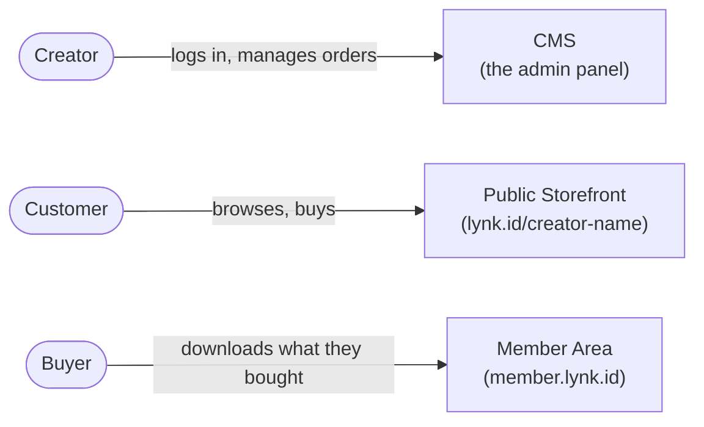
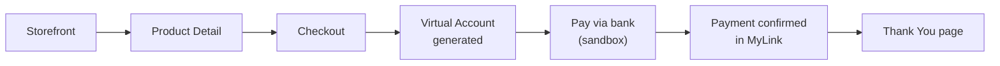
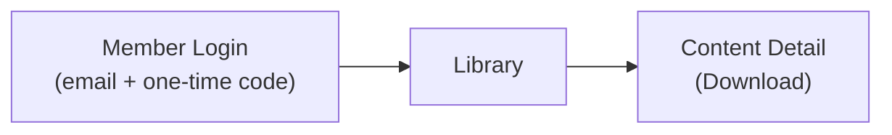
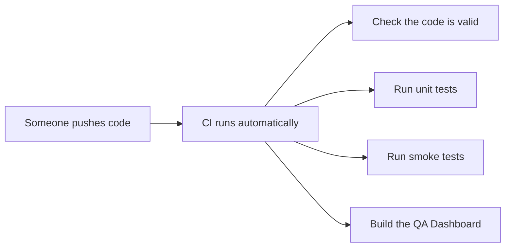

# Qato — QA Automation Platform

Qato automatically checks that Lynk.id's three applications still work, so a human doesn't have
to click through the same login-and-purchase flow by hand every time something changes.

This guide assumes no prior experience with test automation. If you already know Playwright,
Page Objects, and CI pipelines, you probably want the technical reference instead:
[`docs/ENGINEERING.md`](docs/ENGINEERING.md).

---

## Quick navigation by role

| If you are a... | Start with |
|---|---|
| QA Manual tester / UAT team member | [What Qato does](#what-qato-does), [Reading a test report](#reading-a-test-report) |
| Junior QA / QA Automation Engineer | [Getting started](#getting-started), [What's actually tested today](#whats-actually-tested-today) |
| Developer | [Getting started](#getting-started), then [`docs/ENGINEERING.md`](docs/ENGINEERING.md) |
| Business Analyst / Product Manager | [What Qato does](#what-qato-does), [What's actually tested today](#whats-actually-tested-today) |
| DevOps Engineer | [How tests run automatically](#how-tests-run-automatically-cicd), then [`ci/README.md`](ci/README.md) |

---

## What Qato does

Lynk.id has three applications:



Every time one of these changes, someone needs to check it still works: can a creator still log
in? Can a customer still buy something? Can a buyer still download what they paid for? Doing this
by hand, every time, for every change, doesn't scale. Qato does it automatically instead, using a
tool called **Playwright** that drives a real web browser the same way a person would — clicking
buttons, typing into fields, checking that the right thing appears on screen.

This is called **test automation**, and the individual checks are called **automated tests** (or
just "tests"). A collection of related tests is a **test suite**.

---

## What's actually tested today

Qato doesn't test everything yet — it tests three real, verified flows. Being upfront about scope
matters more than sounding comprehensive: if a test doesn't exist yet, that's stated plainly below
rather than implied to be covered.

### 1. Creator login and order visibility

A creator logs into the CMS and confirms their Product Orders list loads. This is the simplest
flow — the "is the CMS even up" check.

### 2. Guest checkout and payment (the purchase flow)



A customer browses the storefront, picks a product, checks out as a guest (email only, no
account), and pays using a **Virtual Account** — a common Indonesian payment method where the
bank generates a unique account number to transfer money into. In development and staging, this
payment is completed automatically through Duitku's **sandbox** (a safe, fake-money testing
environment payment providers offer so nobody has to use real money to test a real payment flow).
The test confirms the payment shows as complete back on the site, and that a "Thank You" page
appears.

This only runs in development and staging — not production, where a live payment can't safely be
simulated the same way.

### 3. Member login, library, and download



A member logs into the Member Area and downloads something they've already purchased.

**Important limitation:** logging into the Member Area requires a one-time password (a 6-digit
code, usually called an **OTP** — "one-time password" — sent to the member's real email inbox
every time). Nobody has built a way to fetch that code automatically yet, so this specific test
**cannot run unattended**. A human has to check the inbox, grab the code, and supply it manually
each time this test runs. It's not broken — it's a real, current limitation, explained further in
[Known limitations](#known-limitations).

---

## Key terms you'll see

Explained here once, in plain language, so the rest of this guide doesn't have to keep stopping to
define things.

| Term | What it means |
|---|---|
| **Repository** ("repo") | The folder containing all of Qato's code, tracked by a tool called Git so changes are recorded over time. |
| **Clone** | Downloading a copy of the repository onto your own computer. |
| **Terminal** / **command line** | A text-based window where you type commands instead of clicking. Every instruction below that starts with `$` is something you type into a terminal. |
| **Dependencies** | Other people's code that Qato relies on (e.g. Playwright itself). Installing dependencies downloads all of it in one step. |
| **pnpm** | The tool used to install dependencies and run project commands. Similar to `npm`, if you've heard of that. |
| **Monorepo** | One repository containing several related projects (the test automation, the dashboard, shared config) instead of scattering them across separate repositories. |
| **Environment** | Which version of the app you're testing against — your local machine, the development server, staging (a pre-production copy), or production (the real, live site). |
| **Environment file** (`.env.dev`, etc.) | A file listing which web addresses and login details to use for a given environment. Covered in [Setting up your environment](#3-set-up-your-environment). |
| **Test suite** | A group of related automated tests. |
| **Smoke test** | A quick, shallow test suite meant to answer "is anything obviously broken?" fast — not exhaustive, but fast enough to run on every code change. |
| **CI / CI-CD** | "Continuous Integration / Continuous Delivery" — running tests automatically (e.g. every time someone pushes code), instead of a person remembering to run them. |
| **JUnit report** | A standard file format test tools use to record what passed, what failed, and why. Machine-readable; you won't usually read it directly. |
| **Dashboard** | Qato's own web page that reads that report and shows it in a human-friendly way. See [The QA Dashboard](#the-qa-dashboard). |

---

## Getting started

### Prerequisites

You'll need two things installed on your computer first:

1. **Node.js**, version 22. This project pins the exact version in a file called `.nvmrc`.
2. **A terminal.** On macOS/Linux, the built-in Terminal app works. On Windows, use PowerShell or
   WSL.

Check you have Node installed by running:

```bash
node --version
```

You should see something like `v22.x.x`. If you don't have Node at all, install it from
[nodejs.org](https://nodejs.org) before continuing.

### 1. Get the code

```bash
git clone <repository-url>
cd qato
```

("Clone" just means download a copy — see [Key terms](#key-terms-youll-see).)

### 2. Install dependencies

```bash
corepack enable
pnpm install
```

The first command turns on `pnpm` (it ships with Node but is off by default). The second
downloads everything Qato needs to run — Playwright, the testing libraries, everything. This can
take a minute or two the first time.

**One more one-time step** — install the actual browsers Playwright will control:

```bash
npx playwright install
```

Without this step, tests will fail immediately with an error about a missing browser.

### 3. Set up your environment

Qato needs to know which environment to test against and what credentials to use. This lives in
files named `.env.local`, `.env.dev`, `.env.staging`, and `.env.prod` at the top of the project.

Some values are already filled in (the web addresses for each environment, a test product, a test
member account). Others are placeholders that say `CHANGE_ME` — specifically the CMS login
username and password. **You need real values for those before creator-login tests will work.**
Ask a team member with CMS access for test credentials, then edit `.env.local` (or whichever
environment file you're using) and replace `CHANGE_ME`.

Don't have real CMS credentials yet? That's fine — the guest checkout test doesn't need them, so
you can still run part of the suite while you sort that out.

### 4. Run the tests

To run the smoke suite (the fast, everyday check):

```bash
pnpm test:smoke
```

You'll see output scroll by in the terminal — each test's name followed by a pass or fail. A
successful run looks roughly like:

```
✓  [cms] › login.spec.ts:5:5 › creator can log in and view the Product Orders list
✓  [public] › guest-checkout.spec.ts:22:5 › guest can complete checkout...
✓  [member] › request-otp.spec.ts:5:5 › member can request an OTP...

3 passed (12.4s)
```

By default this runs against the `local` environment. To run against a different one:

```bash
APP_ENV=staging pnpm test:smoke
```

There's also a broader **regression suite** (`pnpm test:regression`) that includes everything in
smoke plus a few more thorough checks — some of which need extra manual input (like the OTP code
mentioned above) and will skip themselves cleanly if you don't provide it, rather than fail.

### 5. Look at the results

Once tests finish, two things are generated automatically:

- **An HTML report** at `automation/playwright/reports/html/index.html` — open this file in any
  web browser (double-click it, or drag it into a browser window). It shows every test, and for
  any failure, a screenshot, a video recording, and a step-by-step trace of exactly what the
  browser did.
- **A JUnit XML file** at `automation/playwright/reports/junit/results.xml` — this is the
  machine-readable version, mainly used by CI and the Dashboard. You generally don't need to open
  this yourself.

---

## Reading a test report

Every test ends in one of three states:

| Status | What it means |
|---|---|
| **Passed** ✓ | The check succeeded — the app did what was expected. |
| **Failed** ✗ | Something didn't match what was expected. This needs investigating — see [When a test fails](#when-a-test-fails). |
| **Skipped** | The test intentionally didn't run. Not a failure — usually because something it needs (like a fresh OTP code) wasn't provided. |

For a failed test, the HTML report (see above) is the best place to look: it shows exactly what
the browser saw at the moment of failure, alongside a video of everything leading up to it.

---

## The QA Dashboard

Qato includes a small web app that reads the same report and shows it as a simple dashboard: a
pass-rate ring, counts of passed/failed/skipped, and a table of every test with its status and
duration. It's meant to be the fastest way to answer "did the last run go okay?" without opening a
terminal.

To run it:

```bash
cd apps/qa-dashboard
pnpm dev
```

Then open `http://localhost:3000` in your browser. If no test run has happened yet, it'll tell you
so and suggest running `pnpm test:smoke` first — it only ever shows the result of the most recent
run, not history over time (a deliberate, current limitation — see
[Known limitations](#known-limitations)).

---

## When a test fails

A step-by-step checklist, roughly in the order worth checking:

1. **Read the error message in the terminal first.** Playwright's error messages are usually
   specific (e.g. "element not found" or "timed out waiting for..."), and often tell you exactly
   what to check.
2. **Open the HTML report** (`automation/playwright/reports/html/index.html`). Click the failed
   test. Look at the screenshot and the trace — this is almost always faster than guessing from
   text alone.
3. **Check for `CHANGE_ME` errors.** If the error mentions an environment variable and says
   something like "must not be empty" or a validation failure, you likely still have a placeholder
   credential — see [Set up your environment](#3-set-up-your-environment).
4. **Check whether the real application actually changed.** Sometimes a test fails because the
   real app's design changed (a button moved, a label changed) — not because anything is "broken."
   That's useful information too; flag it to whoever owns that part of the app.
5. **For the OTP-dependent download test specifically** — it's *expected* to skip unless you supply
   a fresh code yourself. See [Known limitations](#known-limitations).

---

## How tests run automatically (CI/CD)



Every time code is pushed, this happens automatically — nobody has to remember to run tests
manually. Qato supports two CI providers today:

- **GitHub Actions** (primary)
- **Azure DevOps** (secondary)

Both run the exact same checks — they're just two different ways of triggering the same
underlying scripts, so switching between them (or adding another provider later) doesn't require
rewriting how tests actually work. If you're setting this up for a team, see
[`ci/README.md`](ci/README.md) for what secrets/credentials need to be configured first.

There's also a nightly scheduled run (using the broader regression suite) and a manual "release
gate" check — details in [`ci/README.md`](ci/README.md).

---

## Known limitations

Being direct about what doesn't exist yet is more useful than a guide that implies everything's
covered.

- **The Member Area download test can't run unattended.** It needs a real, fresh 6-digit code from
  an actual inbox every time. There's no automated way to fetch that code yet, so this test always
  needs a human to supply it.
- **The Virtual Account payment test also can't run fully unattended.** The exact amount to pay
  (which includes a payment-gateway fee on top of the product price) has to be read off the
  checkout page and supplied by hand — there's no way to extract it automatically yet.
- **The Dashboard shows only the latest run, not history.** There's no database yet — it reads the
  most recent report file directly. Trends over time aren't available.
- **Only three environments are fully covered:** local, development, and staging use the same test
  product; production uses a different one, and one specific product-display format hasn't been
  verified there yet (a checkout test will skip itself in production rather than guess).
- **Only guest checkout + payment, creator login, and member login/download are automated.**
  Everything else in the CMS, storefront, or member area isn't tested yet.

For the full technical reasoning behind each of these (and everything else), see
[`docs/ENGINEERING.md`](docs/ENGINEERING.md).

---

## Where things live

A brief map — full detail in [`docs/ENGINEERING.md`](docs/ENGINEERING.md).

```
qato/
├── automation/playwright/   # the tests themselves
├── apps/qa-dashboard/       # the results dashboard
├── ci/                      # scripts shared by every CI provider
├── shared/                  # environment/config logic
└── docs/ENGINEERING.md      # full technical reference
```

---

## Getting help

- **Something looks broken and you're not sure why:** start with
  [When a test fails](#when-a-test-fails) above.
- **You want to understand how something is built, or why a decision was made:**
  [`docs/ENGINEERING.md`](docs/ENGINEERING.md) has the full reasoning, including places where a
  judgment call was made and explicitly flagged.
- **You want to set up CI for a new team/project:** [`ci/README.md`](ci/README.md).
